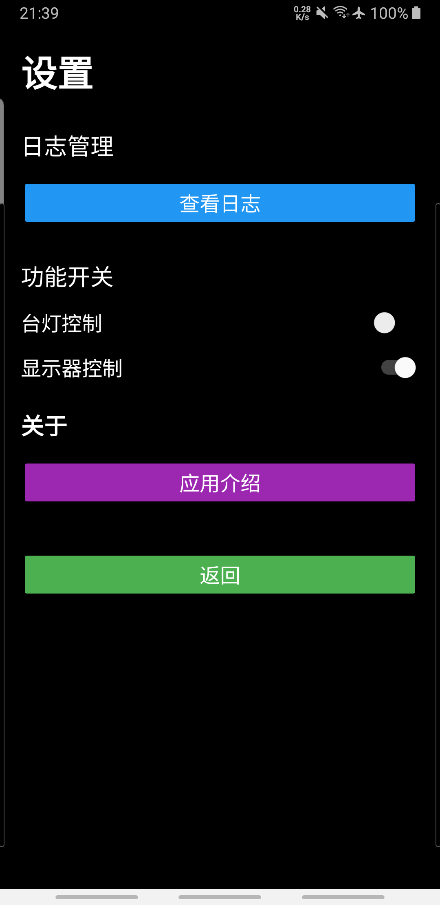

# 控制屏 - USB Display Control

通过 Android 手机远程控制 Windows 电脑显示器模式的工具。

## 功能特性

- ✅ **实时状态检测** - 自动获取当前显示器配置状态
- ✅ **一键切换** - 支持 4 种显示模式切换
- ✅ **USB 连接** - 通过 ADB reverse 建立稳定通信
- ✅ **紧凑界面** - 一行式控制布局，简洁直观
- ✅ **黑色主题** - OLED 友好，省电防烧屏
- ✅ **设置功能** - 可启用/禁用各项功能
- ✅ **日志查看** - 实时查看系统日志

## 系统架构

```
┌─────────────┐      USB/ADB       ┌─────────────┐
│  Android    │ ←─────────────────→ │   PC Server │
│    App      │    tcp:8765        │  (Python)   │
└─────────────┘                     └──────┬──────┘
                                           │
                                    ┌──────▼──────┐
                                    │  Windows    │
                                    │   Display   │
                                    └─────────────┘
```

## 界面预览

### 主界面


### 设置界面


**界面说明**：
- **⚙️ 设置按钮** - 右上角配置入口
- **Ready/Not Ready** - 服务器连接状态（可点击手动检查）
- **第一屏 ☑** - 笔记本内置显示器开关
- **第二屏 ☑** - 外接显示器开关

## 支持的模式

| 模式 | 说明 | 适用场景 |
|------|------|----------|
| 仅第一屏 | 只使用笔记本内置屏幕 | 会议室演示、移动办公 |
| 仅第二屏 | 只使用外接显示器 | 桌面办公、合盖使用 |
| 扩展模式 | 双屏扩展显示 | 多任务处理、编程开发 |
| 复制模式 | 双屏显示相同内容 | 教学培训、展示分享 |

## 安装说明

### 1. PC 端（Windows）

**前置要求**：
- Python 3.8+
- Android SDK Platform Tools (ADB)
- Windows 系统（支持多显示器）

**安装步骤**：

```bash
# 1. 安装 Python 依赖（如有需要）
pip install -r requirements.txt

# 2. 启动服务器
python usb_display_control.py
```

**服务器功能**：
- 自动检测 ADB 设备
- 建立 ADB reverse 端口转发
- 监听端口 8765
- 执行显示器切换命令

### 2. Android 端

**安装 APK**：

```bash
# 通过 ADB 安装
adb install app/build/outputs/apk/debug/app-debug.apk
```

**或者手动安装**：
1. 将 APK 文件复制到手机
2. 在手机上点击安装

**权限要求**：
- 无特殊权限要求
- 不需要 ROOT

## 使用方法

### 快速开始

1. **连接设备**
   - 使用 USB 线连接手机和电脑
   - 手机开启 USB 调试模式

2. **设置端口转发**
   ```bash
   adb reverse tcp:8765 tcp:8765
   ```

3. **启动 PC 服务器**
   ```bash
   cd server
   python usb_display_control.py
   ```

4. **打开 Android 应用**
   - 启动 "控制屏" 应用
   - 查看状态按钮（应显示 "Ready"）
   - 勾选/取消显示器开关

### 操作说明

**切换显示器模式**：
- ✅ 第一屏 + ✅ 第二屏 = **扩展模式**
- ✅ 第一屏 + ☐ 第二屏 = **仅第一屏**
- ☐ 第一屏 + ✅ 第二屏 = **仅第二屏**
- ☐ 第一屏 + ☐ 第二屏 = **自动切换回仅第一屏**（防止全关）

**手动检查服务器**：
- 点击 "Ready" / "Not Ready" 按钮
- 查看详细连接日志
- 自动同步显示器状态（每 10 秒）

**设置功能**：
1. 点击右上角 ⚙️ 按钮进入设置
2. 可启用/禁用台灯控制
3. 可启用/禁用显示器控制
4. 点击"查看日志"查看系统日志

## 技术细节

### 通信协议

**HTTP API**：

```
GET /status
响应：
{
  "status": "ok",
  "mode": 1,
  "mode_name": "internal",
  "server": "running",
  "realtime": true
}

POST /
请求体：
{
  "command": "internal|external|extend|clone"
}
```

### 显示器检测

使用 PowerShell 查询 Windows 显示配置：

```powershell
Add-Type -AssemblyName System.Windows.Forms
$screens = [System.Windows.Forms.Screen]::AllScreens
```

**检测逻辑**：
- 0 个屏幕 = 未知
- 1 个屏幕 + 主屏幕 = 仅第一屏
- 1 个屏幕 + 非主屏幕 = 仅第二屏
- 2+ 个屏幕 = 扩展模式

### 显示器切换

调用 Windows 系统命令：

```bash
DisplaySwitch.exe /internal   # 仅第一屏
DisplaySwitch.exe /external   # 仅第二屏
DisplaySwitch.exe /extend     # 扩展模式
DisplaySwitch.exe /clone      # 复制模式
```

## 测试

运行自动化测试套件：

```bash
cd c:\VOLCANO\myws\andr
python test_display_control.py
```

**测试覆盖**：
- ✅ 服务器基础功能
- ✅ 显示器状态检测
- ✅ 显示器切换控制
- ✅ Android 端通信
- ✅ 错误处理
- ✅ 集成测试

详细测试规范见 [TEST_SPEC.md](TEST_SPEC.md)

## 故障排除

### 常见问题

**1. 手机显示 "Not Ready"**
- 检查 USB 连接是否正常
- 确认 ADB reverse 已设置
- 检查 PC 服务器是否运行

**2. 切换显示器失败**
- 确保显示器驱动正常
- 检查 Windows 显示设置
- 等待 5-10 秒切换完成

**3. 状态不同步**
- 点击 "Ready" 按钮手动刷新
- 等待 10 秒自动轮询
- 重启 PC 服务器

### 日志查看

**Android 端**：
- 点击 "查看日志" 按钮
- 查看详细调试信息

**PC 端**：
- 查看服务器控制台输出
- PowerShell 检测日志
- HTTP 请求日志

## 项目结构

```
c:\VOLCANO\myws\andr\
├── usb_display_control.py      # PC 服务器主程序
├── test_display_control.py     # 自动化测试脚本
├── TEST_SPEC.md                # 测试规范文档
├── README.md                   # 本文档
├── app_screenshot.png          # 应用界面截图
└── app/
    ├── src/main/
    │   ├── java/com/example/clockapp/
    │   │   ├── MainActivity.java           # 主界面
    │   │   └── WindowsDisplayController.java  # 显示控制器
    │   └── res/
    │       ├── layout/
    │       │   └── activity_main.xml       # 界面布局
    │       └── drawable/                   # UI 资源
    └── build/outputs/apk/debug/
        └── app-debug.apk                   # Android 安装包
```

## 版本历史

### v1.0.0 (2026-04-27)
- ✅ 实时显示器状态检测
- ✅ 4 种显示模式切换
- ✅ 紧凑一行式布局
- ✅ 白色 CheckBox（黑色背景可见）
- ✅ ADB reverse 通信
- ✅ 自动状态轮询（10 秒间隔）
- ✅ 手动刷新功能
- ✅ 防止双屏全关保护
- ✅ 设置页面（功能开关）
- ✅ 日志查看功能
- ✅ 黑色主题优化

## 开发说明

### 构建 Android 应用

```bash
cd c:\VOLCANO\myws\andr\app
..\gradlew.bat assembleDebug
```

APK 输出位置：
```
app/build/outputs/apk/debug/app-debug.apk
```

### 修改服务器代码

编辑 `usb_display_control.py` 后需要重启服务器：

```bash
# 停止旧进程
taskkill /F /IM python.exe

# 启动新进程
python usb_display_control.py
```

## 贡献

欢迎提交问题和改进建议！

## 许可证

本项目仅供学习和个人使用。

## 开发者

- **开发者**: Volcano Chen
- **GitHub**: https://github.com/volcanochen/screen
- **🤖 AI 开发**: 本应用由 AI 助手辅助开发

---

**最后更新**: 2026-04-27  
**维护者**: Volcano Chen
