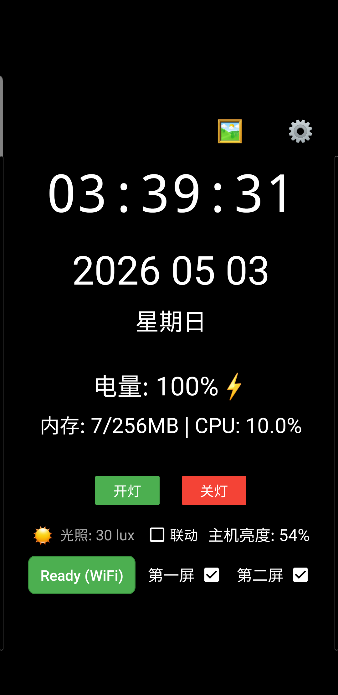

# 控制屏 - Desktop Control Hub

让你的旧手机成为桌面工作娱乐空间的便捷控制台，实现远程控制电脑显示器、投放图片等功能。

## 功能特性

### 🖥️ 显示器控制
- ✅ **实时状态检测** - 自动获取当前显示器配置状态
- ✅ **一键切换** - 支持 4 种显示模式切换（仅第一屏/仅第二屏/扩展/复制）
- ✅ **防止误操作** - 智能保护，防止双屏同时关闭

### 📱 图片投放
- ✅ **图片投放** - PC 端向手机端投放图片并全屏显示
- ✅ **手势控制** - 双指缩放、单指移动、双击切换尺寸
- ✅ **自动弹窗** - 投放图片时手机自动弹出显示界面
- ✅ **远程关闭** - 支持远程关闭手机端图片显示窗口
- ✅ **外部查看器** - 一键用系统默认图片浏览器查看

### 🛠️ 系统工具
- ✅ **系统托盘服务** - Windows 通知栏控制，支持投放、清除、缩放操作
- ✅ **亮度控制** - PC 端亮度调节，手机端光照传感器联动
- ✅ **网速测试** - USB/WiFi 连接速度测试
- ✅ **日志查看** - 实时查看系统日志

### 🎨 用户体验
- ✅ **USB 连接** - 通过 ADB reverse 建立稳定通信
- ✅ **WiFi 连接** - 通过局域网无线连接，支持自动选择通信方式
- ✅ **紧凑界面** - 一行式控制布局，简洁直观
- ✅ **黑色主题** - OLED 友好，省电防烧屏
- ✅ **设置功能** - 可启用/禁用各项功能，配置 WiFi 服务器地址

## 系统架构

```
┌─────────────────────┐      USB/ADB       ┌─────────────────────┐
│     Android App     │ ←─────────────────→ │     PC Server       │
│  ┌───────────────┐  │    tcp:8765        │  ┌───────────────┐   │
│  │ 显示控制界面   │  │                    │  │ 显示器控制     │   │
│  ├───────────────┤  │                    │  ├───────────────┤   │
│  │ 图片投放界面   │  │                    │  │ 图片投放服务   │   │
│  └───────────────┘  │                    │  ├───────────────┤   │
│                     │                    │  │ 系统托盘服务   │   │
└─────────────────────┘                    └───┴───────────────┘───┘
                                                      │
                                               ┌──────▼──────┐
                                               │  Windows    │
                                               │   Display   │
                                               └─────────────┘
```

## 界面预览



**界面说明**：
- **⚙️ 设置按钮** - 右上角配置入口
- **Ready/Not Ready** - 服务器连接状态（可点击手动检查）
- **第一屏 ☑** - 笔记本内置显示器开关
- **第二屏 ☑** - 外接显示器开关

## 支持的模式

| 模式 | 说明 | 适用场景 |
|------|------|----------|
| 仅第一屏 | 只使用笔记本内置屏幕 | 会议室演示、移动办公 |
| 仅第二屏 | 只使用外接显示器 | 桌面办公、合盖使用 |
| 扩展模式 | 双屏扩展显示 | 多任务处理、编程开发 |
| 复制模式 | 双屏显示相同内容 | 教学培训、展示分享 |

## 安装说明

### 1. PC 端（Windows）

**前置要求**：
- Python 3.8+
- Android SDK Platform Tools (ADB)
- Windows 系统（支持多显示器）

**安装步骤**：

```bash
# 1. 进入服务器目录
cd server

# 2. 启动服务器
python core/usb_display_control.py
```

**服务器功能**：
- 自动检测 ADB 设备
- 建立 ADB reverse 端口转发
- USB 断开后自动重连
- 监听端口 8765
- 执行显示器切换命令
- 图片投放服务
- 亮度控制
- 网速测试
- HTTP API 接口

**相关脚本**：
- `core/usb_display_control.py` - 主服务器程序
- `core/windows_display_server.py` - Windows 显示器控制（Flask 备用方案）
- `tools/adb_listener.py` - ADB 连接监听器
- `tools/adb_display_server.py` - ADB 显示服务器
- `scripts/start_usb_display.bat` - Windows 快速启动脚本

### 2. Android 端

**安装 APK**：

```bash
# 通过 ADB 安装
adb install app/build/outputs/apk/debug/app-debug.apk
```

**或者手动安装**：
1. 将 APK 文件复制到手机
2. 在手机上点击安装

**权限要求**：
- 无特殊权限要求
- 不需要 ROOT

## 使用方法

### 快速开始

#### USB 连接方式（推荐）

1. **连接设备**
   - 使用 USB 线连接手机和电脑
   - 手机开启 USB 调试模式

2. **设置端口转发**
   ```bash
   adb reverse tcp:8765 tcp:8765
   ```

3. **启动 PC 服务器**
   ```bash
   cd server
   python core/usb_display_control.py
   ```
   
   或使用 Windows 批处理：
   ```bash
   cd server
   scripts\start_usb_display.bat
   ```

4. **打开 Android 应用**
   - 启动 "控制屏" 应用
   - 查看状态按钮（应显示 "Ready (USB)"）
   - 勾选/取消显示器开关

#### WiFi 连接方式

1. **准备工作**
   - 确保手机和电脑在同一局域网
   - 启动 PC 服务器，记录控制台显示的 IP 地址

2. **配置手机端**
   - 打开应用设置
   - 在「通信方式」中选择「仅 WiFi」或「自动选择」
   - 输入 WiFi 服务器地址（步骤 1 记录的 IP）
   - 端口保持 8765

3. **测试连接**
   - 点击「测试连接」验证设置
   - 状态按钮应显示 "Ready (WiFi)"

### 操作说明

**切换显示器模式**：
- ✅ 第一屏 + ✅ 第二屏 = **扩展模式**
- ✅ 第一屏 + ☐ 第二屏 = **仅第一屏**
- ☐ 第一屏 + ✅ 第二屏 = **仅第二屏**
- ☐ 第一屏 + ☐ 第二屏 = **自动切换回仅第一屏**（防止全关）

**手动检查服务器**：
- 点击 "Ready" / "Not Ready" 按钮
- 查看详细连接日志
- 自动同步显示器状态（每 10 秒）

**设置功能**：
1. 点击右上角 ⚙️ 按钮进入设置
2. 可启用/禁用台灯控制
3. 可启用/禁用显示器控制
4. 点击"查看日志"查看系统日志

**图片投放功能**：
1. 在 PC 端系统托盘右键点击 "Cast Image..."
2. 选择要投放的图片文件
3. 手机端会自动弹出图片显示界面
4. 支持手势操作：双指缩放、单指移动、双击切换尺寸
5. 点击右上角按钮可使用系统默认图片浏览器查看

**系统托盘操作**：
- **Open Status Window** - 打开服务器状态窗口
- **Cast Image...** - 选择并投放图片到手机
- **Clear Image** - 清除手机端显示的图片
- **Zoom In** - 放大图片
- **Zoom Out** - 缩小图片
- **Exit** - 退出服务器

## 技术细节

### 通信协议

**HTTP API**：

```
GET /status
响应：
{
  "status": "ok",
  "mode": 1,
  "mode_name": "internal",
  "server": "running",
  "realtime": true
}

POST /
请求体：
{
  "command": "internal|external|extend|clone"
}
```

**图片投放 API**：

```
GET /image/status
响应：
{
  "has_image": true,
  "image_name": "photo.jpg",
  "auto_popup": true,
  "close_window": false,
  "scale_level": 1.0,
  "last_update": 1714713600.0
}

GET /image/data
响应：图片二进制数据（Content-Type: image/jpeg）

GET /image/poll?t=<timestamp>
响应：
{
  "has_update": true,
  "state": { ... }
}

GET /image/list?dir=<path>
响应：
{
  "images": ["photo1.jpg", "photo2.png"],
  "directory": "C:/Users/photos"
}

POST /image/upload
请求：multipart/form-data
参数：file - 图片文件

POST /image/cast
请求体：
{
  "file": "C:/path/to/image.jpg",
  "auto_popup": true
}

GET /image/cast?file=<path>
响应：同 POST /image/cast

POST /image/clear
响应：
{
  "success": true,
  "close_window": true
}

POST /image/scale
请求体：
{
  "scale": 1.5
}

POST /image/zoom-in
POST /image/zoom-out
POST /image/zoom-reset

POST /image/ack-popup
POST /image/ack-close
```

**其他 API**：

```
POST /brightness
请求体：
{
  "brightness": 50
}

GET /ping
响应：{"status": "pong"}

GET /download
响应：10MB 测试数据（速度测试）

POST /upload
请求：原始二进制数据（速度测试）

GET /api
响应：所有 API 列表文档
```

### 显示器检测

使用 PowerShell 查询 Windows 显示配置：

```powershell
Add-Type -AssemblyName System.Windows.Forms
$screens = [System.Windows.Forms.Screen]::AllScreens
```

**检测逻辑**：
- 0 个屏幕 = 未知
- 1 个屏幕 + 主屏幕 = 仅第一屏
- 1 个屏幕 + 非主屏幕 = 仅第二屏
- 2+ 个屏幕 = 扩展模式

### 显示器切换

调用 Windows 系统命令：

```bash
DisplaySwitch.exe /internal   # 仅第一屏
DisplaySwitch.exe /external   # 仅第二屏
DisplaySwitch.exe /extend     # 扩展模式
DisplaySwitch.exe /clone      # 复制模式
```

## 测试

运行自动化测试套件：

```bash
cd c:\VOLCANO\myws\andr

# 显示器控制测试
python test/display/test_display_control.py

# 网络和 ADB 测试
python test/network/test_adb.py
python test/network/test_usb_speed.py

# 图片投放测试
python test/imagecast/test_api.py
python test/imagecast/test_image_casting.py
python test/imagecast/test_new_api.py

# 完整 API 端点测试
python test/test_all_api.py

# 亮度控制测试
python test/test_brightness.py
```

**测试覆盖**：
- ✅ 服务器基础功能
- ✅ 显示器状态检测
- ✅ 显示器切换控制
- ✅ Android 端通信
- ✅ 错误处理
- ✅ 集成测试
- ✅ 图片投放 API 测试
- ✅ 图片投放集成测试
- ✅ 图片数据验证测试
- ✅ 亮度控制测试
- ✅ 网速测试
- ✅ 完整 API 端点测试

## 故障排除

### 常见问题

**1. 手机显示 "Not Ready"**
- 检查 USB 连接是否正常
- 确认 ADB reverse 已设置：`adb reverse tcp:8765 tcp:8765`
- 检查 PC 服务器是否运行
- 查看防火墙设置，确保端口 8765 未被阻止

**2. 切换显示器失败**
- 确保显示器驱动正常
- 检查 Windows 显示设置
- 等待 5-10 秒切换完成
- 以管理员身份运行服务器

**3. 状态不同步**
- 点击 "Ready" 按钮手动刷新
- 等待 10 秒自动轮询
- 重启 PC 服务器
- 重新插拔 USB 连接

**4. ADB 设备未识别**
- 确保已安装 ADB 驱动
- 运行 `adb devices` 检查设备列表
- 重启 ADB 服务：`adb kill-server` 然后 `adb start-server`

### 日志查看

**Android 端**：
- 点击 "查看日志" 按钮
- 查看详细调试信息

**PC 端**：
- 查看服务器控制台输出
- PowerShell 检测日志
- HTTP 请求日志

## 项目结构

```
c:\VOLCANO\myws\andr\
├── README.md                   # 本文档
├── build.gradle                # Gradle 构建配置
├── settings.gradle             # Gradle 设置
├── gradlew.bat                 # Gradle Wrapper (Windows)
│
├── app/                        # Android 应用
│   ├── build.gradle            # App 构建配置
│   └── src/main/
│       ├── java/com/volcano/screen/
│       │   ├── ui/                            # 界面层
│       │   │   ├── MainActivity.java          # 主界面
│       │   │   ├── SettingsActivity.java      # 设置界面
│       │   │   ├── LogActivity.java           # 日志查看
│       │   │   └── AboutActivity.java         # 关于页面
│       │   ├── display/                       # 显示器控制
│       │   │   ├── DisplayController.java     # 控制器接口
│       │   │   ├── DisplayControllerImpl.java # 控制器实现（USB/WiFi）
│       │   │   ├── DisplayManager.java        # 连接管理器
│       │   │   └── BrightnessController.java  # 亮度控制器
│       │   ├── network/                       # 网络层
│       │   │   ├── ServerConnector.java       # HTTP 通信封装
│       │   │   ├── NetworkSpeedTester.java    # 网速测试
│       │   │   └── ConnectionTester.java      # 连接测试
│       │   ├── imagecast/                     # 图片投放
│       │   │   ├── ImageDisplayActivity.java  # 图片显示界面
│       │   │   └── ImageCastingController.java # 图片投放控制器
│       │   └── miio/
│       │       └── MiioDevice.java            # 米家设备控制
│       ├── res/
│       │   ├── layout/
│       │   │   ├── activity_main.xml          # 主界面布局
│       │   │   ├── activity_settings.xml      # 设置界面布局
│       │   │   ├── activity_log.xml           # 日志界面布局
│       │   │   ├── activity_about.xml         # 关于界面布局
│       │   │   └── activity_image_display.xml # 图片显示布局
│       │   ├── drawable/                      # UI 资源
│       │   └── values/
│       │       ├── strings.xml                # 字符串资源
│       │       └── styles.xml                 # 样式资源
│       └── AndroidManifest.xml                # 应用清单
│
├── server/                     # PC 服务器
│   ├── core/                   # 核心服务
│   │   ├── usb_display_control.py  # 主服务器（HTTP API + 显示器控制 + 图片投放）
│   │   └── windows_display_server.py # Windows 显示器控制（Flask 备用方案）
│   ├── display/                # 显示器相关
│   │   ├── get_displays.ps1    # 获取显示器信息
│   │   └── brightness_control.ps1 # 亮度控制脚本
│   ├── imagecast/              # 图片投放工具
│   │   ├── image_uploader.py   # 图片上传处理
│   │   ├── upload_real_image.py # 上传真实图片
│   │   ├── upload_test_image.py # 上传测试图片
│   │   ├── demo_image_casting.py # 演示脚本
│   │   └── demo_simple.py      # 简单演示
│   ├── tray/                   # 系统托盘服务
│   │   └── tray_service.py     # 系统托盘控制
│   ├── tools/                  # 工具脚本
│   │   ├── setup_adb.py        # ADB 端口转发设置
│   │   ├── adb_display_server.py # ADB 显示服务器
│   │   └── adb_listener.py     # ADB 事件监听器
│   ├── scripts/                # 启动脚本
│   │   └── start_usb_display.bat # Windows 启动脚本
│   ├── static/                 # 静态资源
│   │   └── test_cast.jpg       # 测试图片
│   └── README.md               # 服务器文档
│
├── test/                       # 测试套件
│   ├── display/                # 显示器控制测试
│   │   ├── test_display_control.py # 显示器控制测试
│   │   └── test_displays.py    # 显示器检测测试
│   ├── network/                # 网络测试
│   │   ├── test_adb.py         # ADB 测试
│   │   ├── test_usb_speed.py   # USB 速度测试
│   │   └── README.md           # 网络测试文档
│   ├── imagecast/              # 图片投放测试
│   │   ├── test_api.py         # API 测试
│   │   ├── test_image_casting.py # 图片投放集成测试
│   │   ├── test_new_api.py     # 新 API 测试
│   │   └── verify_image_data.py # 图片数据验证
│   ├── TEST_SPEC.md            # 测试规范
│   └── README.md               # 测试文档
│
└── docs/                       # 文档
    ├── README.md               # 设计文档索引
    ├── DESIGN.md               # 设计文档
    ├── USB_DISPLAY_README.md   # USB 显示控制文档
    └── WINDOWS_DISPLAY_README.md  # Windows 显示控制文档
```

## 版本历史

### v1.4.0 (2026-05-03)

**新增功能**：
- ✅ **图片投放** - PC 端向手机端投放图片并显示
- ✅ **手势控制** - 双指缩放、单指移动、双击切换尺寸
- ✅ **系统托盘服务** - Windows 通知栏控制，支持投放、清除、缩放操作
- ✅ **自动弹窗** - 投放图片时手机自动弹出显示界面
- ✅ **远程关闭** - 支持远程关闭手机端图片显示界面
- ✅ **外部查看器** - 点击按钮用系统默认图片浏览器查看
- ✅ **USB 自动重连** - USB 断开后自动检测并重建 ADB reverse
- ✅ **网速测试** - USB/WiFi 连接速度测试

**代码重构**：
- ✅ 图片投放相关代码移入 `imagecast` 包
- ✅ 系统托盘服务移入 `tray` 目录
- ✅ 测试脚本整理到 `test/imagecast/` 目录
- ✅ 设置页面移入 `ui` 包
- ✅ 合并 `WindowsDisplayController` 和 `WifiDisplayController` 为 `DisplayControllerImpl`
- ✅ 新增 `ServerConnector` 网络层封装
- ✅ 服务器端文件按功能分目录（core/display/tools/scripts/static）
- ✅ 亮度控制脚本移入 `display` 目录

**API 接口**：
- ✅ `/image/status` - 获取图片状态
- ✅ `/image/upload` - 上传图片
- ✅ `/image/cast` - 投放指定路径图片
- ✅ `/image/clear` - 清除图片
- ✅ `/image/scale` - 设置缩放比例
- ✅ `/api` - 获取所有可用 API 列表

### v1.3.0 (2026-05-02)

**新增功能**：
- ✅ 亮度控制功能
- ✅ 光照传感器支持
- ✅ 设置页面功能开关优化

### v1.2.0 (2026-04-30)

**增强功能**：
- ✅ 亮度控制滑块
- ✅ 主机亮度联动开关
- ✅ 自动亮度调节

### v1.1.0 (2026-04-27)

**核心功能**：
- ✅ 实时显示器状态检测
- ✅ 4 种显示模式切换（仅第一屏/仅第二屏/扩展/复制）
- ✅ 紧凑一行式布局
- ✅ 白色 CheckBox（黑色背景可见）
- ✅ ADB reverse 通信
- ✅ 自动状态轮询（10 秒间隔）
- ✅ 手动刷新功能
- ✅ 防止双屏全关保护

**增强功能**：
- ✅ 设置页面（功能开关）
- ✅ 日志查看功能
- ✅ 黑色主题优化
- ✅ 状态按钮样式优化
- ✅ Switch 开关控件

**技术实现**：
- ✅ HTTP API 接口
- ✅ PowerShell 显示器检测
- ✅ DisplaySwitch.exe 调用
- ✅ 自动端口转发

**应用信息**：
- 应用名称：控制屏
- 版本号：v1.4.0
- 开发者：Volcano Chen
- GitHub：https://github.com/volcanochen/screen
- 🤖 AI 开发

## 开发说明

### 构建 Android 应用

```bash
# 进入项目目录
cd c:\VOLCANO\myws\andr\app

# 构建 Debug 版本
..\gradlew.bat assembleDebug

# 或使用 Gradle Wrapper
gradlew.bat assembleDebug
```

**APK 输出位置**：
```
app/build/outputs/apk/debug/app-debug.apk
```

### 运行 PC 服务器

```bash
# 进入服务器目录
cd server

# 启动服务器
python core/usb_display_control.py

# 或使用 Windows 批处理
scripts\start_usb_display.bat
```

### 修改服务器代码

编辑 `core/usb_display_control.py` 后需要重启服务器：

```bash
# 停止旧进程
taskkill /F /IM python.exe

# 启动新进程
python core/usb_display_control.py
```

### 运行测试

```bash
# 运行所有测试
cd c:\VOLCANO\myws\andr
python test/test_display_control.py

# 运行特定测试
python test/test_adb.py
```

## 相关文档

- [服务器文档](server/README.md) - PC 服务器详细说明
- [测试规范](test/TEST_SPEC.md) - 测试覆盖范围和标准
- [设计文档](docs/README.md) - 系统设计和架构文档

## 贡献

欢迎提交问题和改进建议！

## 许可证

本项目仅供学习和个人使用。

## 开发者

- **开发者**: Volcano Chen
- **GitHub**: https://github.com/volcanochen/screen
- **🤖 AI 开发**: 本应用由 AI 助手辅助开发

---

**最后更新**: 2026-05-03  
**维护者**: Volcano Chen  
**版本**: v1.4.0
