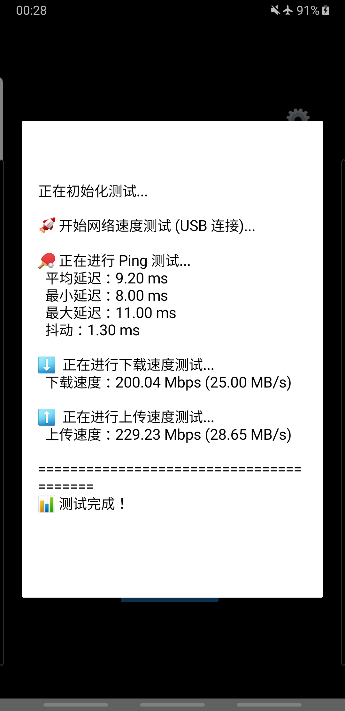

# Speed Test - 网络速度测试工具

测试手机和电脑之间的 USB/WiFi 网络速度。

## 📁 文件说明

### 文档

- `README.md` - 本文档（快速开始指南）
- `PHONE_SPEED_TEST_GUIDE.md` - 详细手机测试指南

### 测试工具

- `test_usb_speed.py` - USB 连接本地测试脚本（PC 端）

### 备用方案（WiFi）

- `simple_speed_test.py` - 简单的 WiFi 测试服务器

---

## 🚀 快速开始

### ⚡ USB 连接测试（主要方案）

**电脑端：**

1. **启动 USB 显示控制服务器：**
   ```bash
   cd ../server
   python usb_display_control.py
   ```

2. **设置 ADB reverse：**
   ```bash
   adb reverse tcp:8765 tcp:8765
   ```

**手机端：**

1. 打开 "控制屏" 应用
2. 点击 **"📊 网速测试"** 按钮
3. 等待测试结果（测试自动进行）

---

### 📶 WiFi 连接测试（备用方案）

**电脑端：**
```bash
python simple_speed_test.py
```

**手机端：**

1. 修改 `app/src/main/java/com/example/clockapp/NetworkSpeedTester.java`
2. 把 `SERVER_URL` 改成电脑 IP
3. 重新编译安装应用
4. 点击 "📊 网速测试" 按钮

---

## 📊 测试内容

| 测试项 | 说明 |
|--------|------|
| **Ping 延迟** | 手机 ↔ 电脑往返时间 (ms) |
| **下载速度** | 电脑 → 手机传输速度 (Mbps) |
| **上传速度** | 手机 → 电脑传输速度 (Mbps) |

---

## 📸 USB 连接速度测试结果



**测试说明：**
- 测试方式：USB 数据线连接（ADB Reverse）
- 测试时间：2026-05-01
- 测试结果（最新截图）：
  - **Ping 延迟**：9.20 ms（平均）
  - **下载速度**：200.04 Mbps (25.00 MB/s)
  - **上传速度**：229.23 Mbps (28.65 MB/s)

---

## 💡 提示

- **USB 连接** 比 WiFi 更稳定更快（推荐）
- 测试时保持手机和电脑稳定连接
- 可以多次测试取平均值以获得更准确结果

---

## 🎯 测试准确性说明

### 当前测试实现

| 测试项 | 实现方式 |
|--------|---------|
| **Ping 延迟** | 测试 5 次，取平均值、最小值、最大值、抖动 |
| **下载速度** | 在 5 秒内连续请求下载，计算平均速度 |
| **上传速度** | 一次性发送 10MB 数据，计算传输速度 |

### 准确性评估

| 方面 | 准确性 | 说明 |
|------|--------|------|
| **Ping 延迟** | ⭐⭐⭐⭐ | 多次测试取平均，比较准确 |
| **下载速度** | ⭐⭐⭐ | 连续请求，有一定代表性 |
| **上传速度** | ⭐⭐ | 只测一次，数据量较小 |

### ⚠️ 影响准确性的因素

1. **只测 1 次上传**
   - 当前上传只测 1 次，结果可能波动
   - 建议：可改进为测多次取平均值

2. **数据量较小**
   - 上传只有 10MB，可能不够充分
   - 建议：数据大时时间会更长但更准确

3. **预热阶段**
   - 没有预热过程，第一次请求可能有延迟
   - 建议：可先做 1-2 次预热再开始正式测试

4. **系统缓存**
   - 可能受系统缓存影响
   - 建议：多次测试时每次结果可能不同，取平均值更好

### 📈 如何提高测试准确性

```
方式 1：多次测试取平均
├─ 每次间隔 10 秒
├─ 测 3-5 次
└─ 取中间值或平均值

方式 2：增加数据量
├─ 上传可增至 20-50MB（需要时间更长）
└─ 下载可延长至 10 秒

方式 3：预热连接
├─ 先做 1-2 次不计时的测试
└─ 丢弃前几次结果
```

### 📊 对结果的解读建议

- **相对比较更有价值**：比绝对数值更有意义
- **多次测试参考**：相同条件下可多次测试看波动
- **关注趋势**：看多次测试的变化趋势
- **USB vs WiFi 对比**：这个测试在做方案选择时最有价值

---

## 📐 测试原理

### USB 连接测试原理

#### 1. ADB Reverse 技术

ADB（Android Debug Bridge）是连接手机和电脑的调试工具。`adb reverse tcp:8765 tcp:8765` 命令实现端口反向代理：

```
┌──────────┐        USB        ┌──────────┐
│  手机    │ ←──────────────→ │  电脑    │
│(Android) │  TCP/8765        │ (Windows) │
└──────────┘                   └──────────┘
```

**工作原理：**

1. 手机访问 `localhost:8765`
2. 通过 USB 线（ADB）传输到电脑
3. 电脑的服务器接收并处理请求
4. 结果通过 USB 线返回到手机

#### 2. 手机端点击测速的完整流程

**点击按钮后发生的事情：**

```
步骤 1：用户点击 "📊 网速测试" 按钮
    ↓
步骤 2：MainActivity.java 调用 speedTester.startFullTest()
    ↓
步骤 3：开始循环执行测试
    ├─ 测试 1：Ping（测延迟）
    ├─ 测试 2：Download（测下载）
    └─ 测试 3：Upload（测上传）
```

**详细数据流向图：**

```
┌─────────────────────────────────────────────────────────────────────────────────┐
│                          📱 手机（Android 端）                                  │
│  ┌───────────────────────────────────────────────────────────────────────────┐   │
│  │ 1️⃣ 点击按钮 │ 2️⃣ startFullTest()      │   │
│  │ └────────────→ └─────────────────────┐    │
│  │                    3️⃣ NetworkSpeedTester.java │    │
│  │                        ├─ test_ping()     │    │
│  │                        ├─ test_download()  │    │
│  │                        └─ test_upload()   │    │
│  └───────────────────────────────────────────────────────────────────────────┘   │
│                              ↓                                                  │
│                ┌─────────────────────────────────────┐                            │
│                │ 4️⃣ HttpURLConnection                │                            │
│                │ 连接: http://localhost:8765        │                            │
│                │ 发送: /ping → /download → /upload  │                            │
│                └─────────────────────────────────────┘                            │
└────────────────────────────┼─────────────────────────────────────────────────┘
                             ↓
                    ┌────────────────────────┐
                    │ 5️⃣ USB 数据线传输        │
                    │ 通过 ADB Reverse 转发  │
                    └────────────────────────┘
                             ↓
┌────────────────────────────┼─────────────────────────────────────────────────┐
│                           💻 电脑（服务器端）                                 │
│                ┌─────────────────────────────────────┐                           │
│                │ 6️⃣ usb_display_control.py            │                           │
│                │    - HTTPServer 监听 8765          │                           │
│                │    - DisplayHandler 处理请求       │                           │
│                └─────────────────────────────────────┘                           │
│                              ↓                                                   │
│               ┌────────────────────────────────────┐                            │
│               │ ping: 返回时间戳                    │                            │
│               │ download: 发送 10MB 数据           │                            │
│               │ upload: 接收 10MB 数据并计时       │                            │
│               └────────────────────────────────────┘                            │
└────────────────────────────┼─────────────────────────────────────────────────┘
                             ↓
                    ┌────────────────────────┐
                    │ 7️⃣ 响应结果通过 USB返回 │
                    └────────────────────────┘
                             ↓
┌────────────────────────────┼─────────────────────────────────────────────────┐
│                          📱 手机（接收结果）                                 │
│  ┌───────────────────────────────────────────────────────────────────────────┐   │
│  │ 8️⃣ 接收响应数据 │ 9️⃣ 计算速度 | 10 更新UI显示结果 │
│  │ └────────────→ └──────────→ └──────────────────┐ │
│  └───────────────────────────────────────────────────────────────────────────┘   │
│                        ✅ 显示测试结果（延迟/下载/上传）                      │
└───────────────────────────────────────────────────────────────────────────────────┘
```

#### 3. 详细步骤说明

**阶段 1：Ping 测试（第 1-2 步）**
1. 手机发送 **GET /ping** 请求到 `localhost:8765`
2. 记录发送时间戳
3. 请求通过 USB 线传到电脑服务器
4. 服务器响应当前时间戳
5. 响应通过 USB 线返回手机
6. **计算延迟：** 接收时间 - 发送时间，单位毫秒

**阶段 2：下载测试（第 3-4 步）**
1. 手机发送 **GET /download** 请求
2. 电脑服务器发送 **10MB 数据** 给手机
3. 手机记录数据大小和传输时长
4. **计算下载速度：** (数据大小 × 8) / 时间 → Mbps

**阶段 3：上传测试（第 5-6 步）**
1. 手机发送 **POST /upload** 请求，带上 10MB 数据
2. 电脑服务器记录接收数据大小和耗时
3. 服务器返回速度结果
4. **计算上传速度：** (数据大小 × 8) / 时间 → Mbps

#### 4. 速度计算方式

| 测试项 | 计算原理 |
|--------|---------|
| **Ping 延迟** | `(响应时间 - 发送时间) * 1000` → 毫秒(ms) |
| **下载速度** | `(数据大小 * 8 / 传输时间) / 1024 / 1024` → Mbps |
| **上传速度** | `(数据大小 * 8 / 传输时间) / 1024 / 1024` → Mbps |

**注意：** Mbps（兆比特每秒）= MB/s（兆字节每秒）× 8

### WiFi 连接测试原理

（备用方案，原理类似，但通过路由器 WiFi 传输）

```
┌──────────┐      WiFi      ┌─────────┐      WiFi      ┌──────────┐
│  手机    │ ←──────────→  │ 路由器  │ ←──────────→  │  电脑    │
│(Android) │  IP:192.168.x  │         │  IP:192.168.x  │ (Windows) │
└──────────┘                └─────────┘                └──────────┘
```

### 为什么 USB 比 WiFi 快？（理论对比，不是当前测试场景）

| 特性 | USB 2.0 | USB 3.0 | WiFi 5GHz | WiFi 2.4GHz |
|------|---------|---------|----------|------------|
| **理论带宽** | 480Mbps | 5Gbps | 3.5Gbps | 600Mbps |
| **实际性能** | 35-40MB/s | 300-400MB/s | 20-80MB/s | 2-15MB/s |
| **稳定性** | 高，物理连接 | 高，物理连接 | 中，易受干扰 | 低，干扰大 |

USB 连接有物理传输介质，无需无线通信开销，因此更稳定更快！

**注意：当前测试场景是 USB 连接，不是 WiFi！WiFi 只是作为备用方案对比说明。**